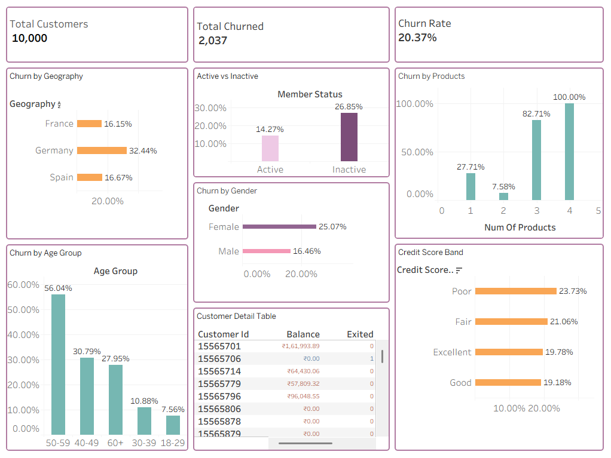

# Bank Customer Churn Prediction & Analysis

## Project Overview

This project analyzes customer churn using the Bank Customer Churn dataset. The objective is to identify the factors influencing customer attrition and build an interactive Tableau dashboard to visualize churn patterns. Additionally, SQL was used for data analysis and Python was used for exploratory data analysis (EDA) and machine learning-based churn prediction.

---

## Dataset Information

- Dataset: Bank Customer Churn
- Source: Kaggle
- Total Customers: 10,000
- Features: 14
- Target Variable: Exited
  - 0 = Customer Retained
  - 1 = Customer Churned

---

## Tools & Technologies

- SQL (MySQL)
- Python
- Jupyter Notebook
- Tableau
- Pandas
- NumPy
- Matplotlib
- Seaborn
- Scikit-learn

---

## Project Workflow

### Phase 1 - SQL Analysis

Performed SQL queries to analyze:

- Total customers
- Total churned customers
- Churn rate
- Churn by geography
- Churn by gender
- Churn by age group
- Churn by number of products
- Credit score analysis
- Active vs inactive members

---

### Phase 2 - Python Analysis

Performed:

- Data Cleaning
- Exploratory Data Analysis (EDA)
- Feature Engineering
- Data Visualization
- Machine Learning Models
  - Logistic Regression
  - Random Forest Classifier
- Model Evaluation

Metrics Used:

- Accuracy
- Precision
- Recall
- F1 Score
- ROC-AUC Score
- Confusion Matrix

---

### Phase 3 - Tableau Dashboard

Created an interactive dashboard consisting of:

- KPI Cards
  - Total Customers
  - Total Churned
  - Churn Rate
- Churn by Geography
- Churn by Age Group
- Churn by Gender
- Churn by Number of Products
- Active vs Inactive Members
- Credit Score Band Analysis
- Customer Detail Table

---

## Business Objective

The dashboard helps banks understand customer churn patterns, identify high-risk customer segments, and support data-driven retention strategies.

---

## Repository

This project demonstrates end-to-end Data Analytics using SQL, Python, and Tableau.

## Author

# Supriya N
